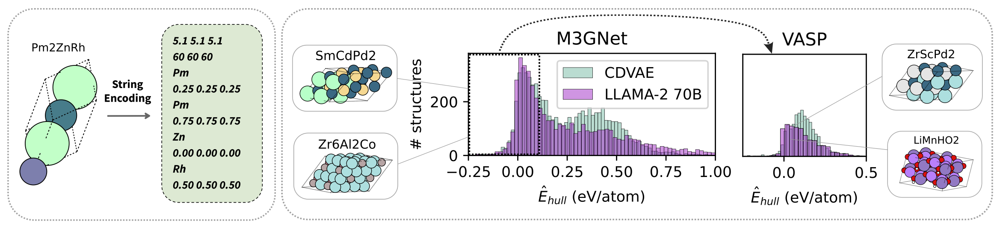

# Fine-Tuned Language Models Generate Stable Inorganic Materials as Text

This repository contains the code for the paper
[_Fine-Tuned Language Models Generate Stable Inorganic Materials as Text_](https://openreview.net/forum?id=0r5DE2ZSwJ)
by Nate Gruver, Anuroop Sriram, Andrea Madotto, Andrew Gordon Wilson, C. Lawrence Zitnick, and Zachary Ward Ulissi (ICLR 2024).

<figure>
  
  <figcaption> We show that finetuned LLMs can be used to generate stable materials using string encodings. These finetuned LLMs can match or exceed the performance of a domain specific diffusion model (CDVAE). LLMs can also be used to mutate existing materials or to sample crystal structures conditioned on text descriptions. </figcaption>
</figure>

## 🛠 Installation
Run the following command to install all dependencies. 
```
source install.sh
```

After installation, activate the environment with
```
conda activate crystal-llm
```
If you prefer not using conda, you can also install the dependencies listed in `install.sh` manually.

## 🚀 Training and Sampling Models
Run training with
```
python llama_finetune.py --run-name 7b-test-run --model 7b
```
and sample from a PEFT model with
```
python llama_sample.py --model_name 7b --model_path=exp/7b-test-run/checkpoint-500 --out_path=llm_samples.csv
```

## License

The majority of crystall-llm is licensed under CC-BY-NC, however portions of the project are available under separate license terms: https://github.com/materialsproject/pymatgen is licensed under the MIT license, https://github.com/huggingface/transformers is licensed under Apache 2.0, and https://gitlab.com/ase/ase/-/ is licensed under GNU Lesser General License

## Citation
Please cite our work as:
```bibtex
@inproceedings{gruver2023llmtime,
    title={Fine-Tuned Language Models Generate Stable Inorganic Materials as Text},
    author={Nate Gruver, Anuroop Sriram, Andrea Madotto, Andrew Gordon Wilson, C. Lawrence Zitnick, and Zachary Ward Ulissi},
    booktitle={International Conference on Learning Representations 2024},
    year={2024}
}
```
